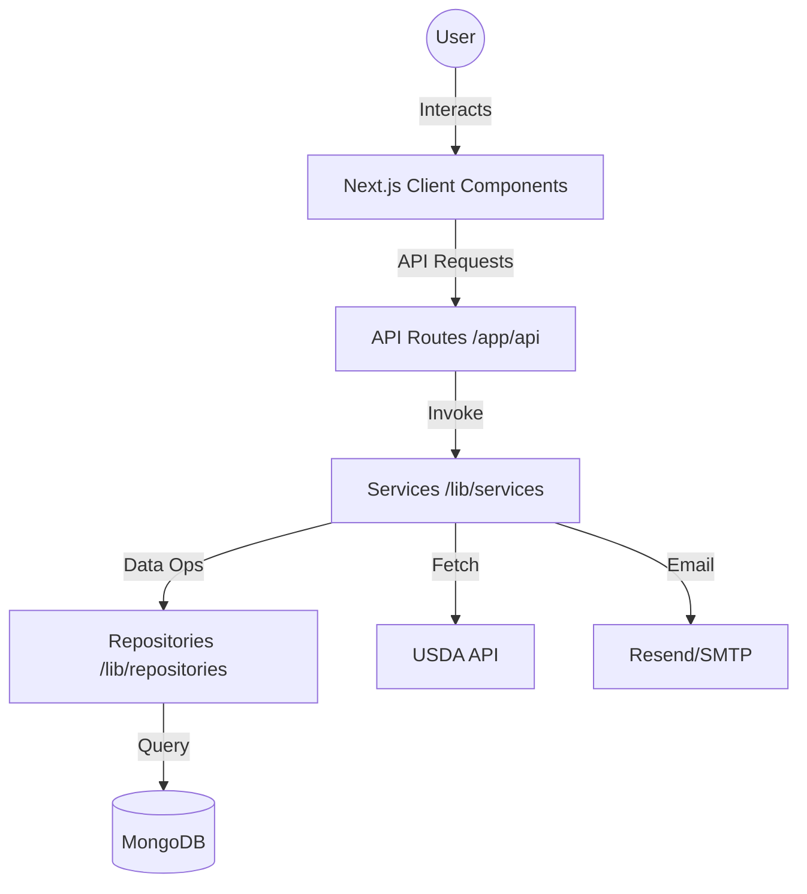

# 🥗 CÉRES | The Elite Culinary & Nutrition Intelligence Platform

**Precision Nutrition. Intelligent Analysis. Seamless Tracking.**

CÉRES is a state-of-the-art, full-stack nutritional ecosystem engineered with **Next.js 16**. It empowers health-conscious users, athletes, and culinary enthusiasts to dissect the molecular composition of their meals, track performance goals, and share culinary masterpieces with a global community.

---

## 💎 Premium Features

### 🧪 Advanced Nutrition Intelligence
- **USDA-Powered Analysis**: Integrated with the **USDA FoodData Central API** for medical-grade nutritional accuracy across thousands of ingredients.
- **Dynamic Macro Mapping**: Instant visualization of Calories, Protein, Carbohydrates, and Fats with precise percentage breakdowns.
- **Micro-Nutrient Insights**: Deep dives into fiber, sugar, and essential vitamins to ensure a balanced lifestyle.

### 🏘️ The Community Hub
- **Recipe Marketplace**: Discover, save, and share high-performance recipes curated by the CÉRES community.
- **Social Integration**: Build your culinary profile and showcase your signature dishes with high-quality visual cards.

### 📈 Performance Dashboard
- **Goal Optimization**: Set sophisticated daily caloric targets and macro-nutrient ratios tailored to your fitness journey.
- **Trend Analysis**: Monitor your progress with intuitive charts and historical meal logs that visualize your nutritional evolution.

### 🔐 Enterprise-Grade Security
- **Secure Auth**: Robust session management powered by **Jose (JWT)** and **Bcryptjs** encryption.
- **Privacy First**: Personalized data silos ensuring your metrics and history remain strictly confidential.

---

## 🛠 Tech Stack

### Frontend Architecture
-  **v16 (App Router)**
-  **v19**
-  **v4**
- 

### Backend & Infrastructure
-  **Mongoose ODM**
- 
- **Lucide React** for premium iconography
- **Resend & Nodemailer** for sophisticated communication flows

---

## 🚀 Deployment & Local Development

### Prerequisites
- **Node.js** (v20+ Recommended)
- **MongoDB** Instance (Local or Atlas)
- **USDA API Key** (Optional for full nutrition search)

### Quick Start
1.  **Clone the Repository**
    ```bash
    git clone https://github.com/abbas/ceres-nutrition.git
    cd ceres-nutrition
    ```

2.  **Configuration**
    Create a `.env` file in the root directory:
    ```env
    MONGODB_URI=your_mongodb_uri
    JWT_SECRET=your_jwt_secret
    USDA_API_KEY=your_usda_key
    ```

3.  **Launch Platform**
    ```bash
    npm install
    npm run dev
    ```

4.  **Access**
    Visit `http://localhost:3000` to experience the future of nutrition tracking.

---

## 🗺 Roadmap
- [ ] AI-Powered Meal Recognition from Photos
- [ ] Integration with Wearable Health Devices (Apple Health, Fitbit)
- [ ] Smart Shopping List Generation based on Weekly Meal Plans
- [ ] Professional Nutritionist Consultation Portal

---

## 🏗 Architecture & Data Flow

CÉRES follows a **Modular Clean Architecture** to ensure scalability and maintainability. It leverages the Next.js App Router for server-side rendering and API routes for backend logic.



---

## 📂 Project Structure

```text
├── app/                  # Next.js App Router (Pages & API)
│   ├── api/              # Backend API Endpoints
│   ├── components/       # Shared UI Components
│   └── (routes)/         # Feature-specific pages (Dashboard, Recipes, etc.)
├── lib/                  # Core Business Logic & Infrastructure
│   ├── models/           # Mongoose Data Models
│   ├── services/         # Orchestration & External API Integration
│   ├── repositories/     # Data Access Layer
│   ├── utils/            # Shared Utilities & Types
│   └── validations/      # Zod Schemas
├── public/               # Static Assets (Images, Icons)
└── proxy.ts              # Authentication & Routing Proxy logic
```

---

## ⚙️ Detailed Configuration

To fully unlock the platform's capabilities, configure the following environment variables in your `.env.local`:

| Variable | Description | Example |
| :--- | :--- | :--- |
| `MONGODB_URI` | Connection string for MongoDB Atlas or Local | `mongodb+srv://...` |
| `JWT_SECRET` | 64-character string for token encryption | `your-secret-key` |
| `USDA_API_KEY` | Key from [USDA FDC](https://fdc.nal.usda.gov/) | `5UOcKZBH...` |
| `RESEND_API_KEY` | For transactional emails via Resend | `re_...` |
| `SMTP_PASSWORD` | App password for SMTP fallback (e.g., Gmail) | `xxxx xxxx xxxx xxxx` |
| `NEXT_PUBLIC_APP_URL`| The base URL of your application | `http://localhost:3000` |

---

## 🤝 Contributing

We welcome contributions from the community! To get started:

1.  **Fork** the repository.
2.  **Create** a feature branch (`git checkout -b feature/AmazingFeature`).
3.  **Commit** your changes (`git commit -m 'Add some AmazingFeature'`).
4.  **Push** to the branch (`git push origin feature/AmazingFeature`).
5.  **Open** a Pull Request.

---

## 📜 License

Distributed under the **MIT License**. See `LICENSE` for more information.

---

Designed with ❤️ for a Healthier World.
