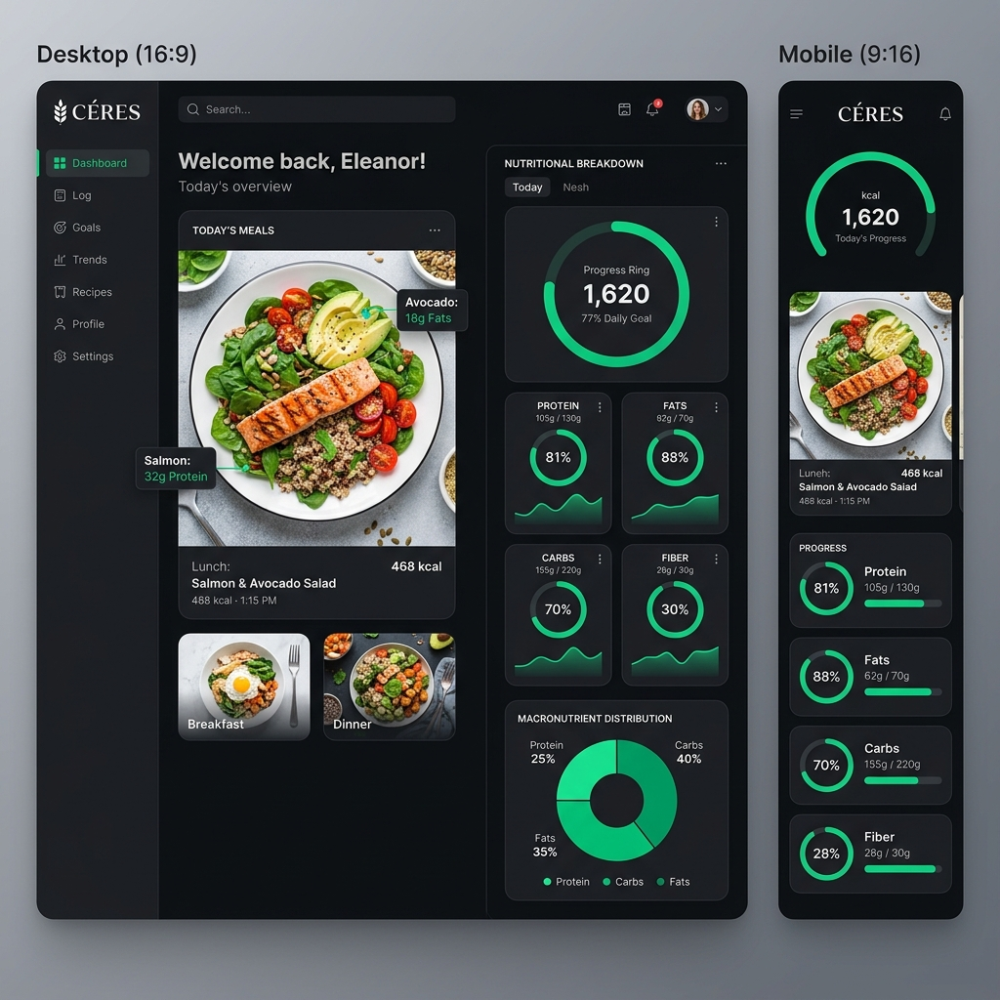

# CÉRES

**Precision Culinary & Nutrition Intelligence Platform**


CÉRES is a high-performance nutritional ecosystem engineered to bridge the gap between raw ingredients and clinical-grade data. It empowers users to dissect the molecular composition of their meals, track long-term health goals, and participate in a global culinary community.

## 📑 Table of Contents

- [🔎 Overview](#🔎-overview)
- [💡 Why CÉRES?](#💡-why-céres)
- [✨ Features](#✨-features)
- [🛠️ Tech Stack](#🛠️-tech-stack)
- [🚀 Getting Started](#🚀-getting-started)
- [📁 Project Structure](#📁-project-structure)
- [🗄️ Database Schema](#🗄️-database-schema)
- [🔐 Authentication & Authorization](#🔐-authentication--authorization)
- [🎨 Styling Guidelines](#🎨-styling-guidelines)
- [🏗️ Development Guidelines](#🏗️-development-guidelines)
- [🆘 Support](#🆘-support)

## 🔎 Overview



CÉRES serves as a unified intelligence layer for health-conscious individuals and culinary professionals. The platform enables:

- **Users** to analyze ingredients via USDA-grade data, track daily macros, and manage personalized health profiles.
- **Communities** to share high-performance recipes and build social culinary identities.
- **Administrators** to oversee the medicine-grade catalog and platform-wide engagement metrics.

## 💡 Why CÉRES?

Nutrition tracking is often fragmented and inaccurate. CÉRES solves this by centralizing high-fidelity data and community insights.

- **Clinical-Grade Accuracy** - Integrated with the USDA FoodData Central API for verified nutritional profiles.
- **Holistic Tracking** - Beyond calories; focus on proteins, fats, fibers, and essential micronutrients.
- **Community Hub** - A collaborative marketplace for sharing nutritional masterpieces.
- **Scalable Architecture** - Built on a modular Next.js 16 stack for speed and reliability.

## ✨ Features

### For Users 🧑‍⚕️
- Real-time ingredient search via USDA API.
- Dynamic macro mapping (Calories, Protein, Carbohydrates, Fats).
- Personal health dashboards with trend visualization.
- Customizable daily nutritional goals and goal tracking.
- Recipe saving and "Community Favorites" library.

### For the Community 🤝
- Recipe Marketplace: Share and discover high-performance meals.
- User Profiles: Showcase your culinary and nutritional journey.
- Social Engagement: Follow and interact with other health enthusiasts.

### For Administrators 🛡️
- Global catalog management.
- User role oversight and platform monitoring.
- Analytics on platform-wide nutritional trends.

## 🛠️ Tech Stack

- **Framework:** Next.js 16 (App Router)
- **Language:** TypeScript
- **Database:** MongoDB with Mongoose ODM
- **Authentication:** Jose (JWT) with Bcryptjs encryption
- **Styling:** Tailwind CSS v4 (PostCSS integration)
- **Iconography:** Lucide React
- **Email:** Resend & Nodemailer (SMTP)

## 🚀 Getting Started

### Prerequisites

- Node.js 20+ and npm
- MongoDB instance (Local or Atlas)
- USDA API Key (Optional for full nutrition search)

### Installation

1. **Clone the repository**
   ```bash
   git clone https://github.com/abbas/techtalks-ceres.git
   cd techtalks-ceres
   ```

2. **Install dependencies**
   ```bash
   npm install
   ```

3. **Set up environment variables**
   Create a `.env.local` file in the root directory:
   ```env
   MONGODB_URI="your-mongodb-uri"
   JWT_SECRET="your-secret-key"
   USDA_API_KEY="your-usda-key"
   NEXT_PUBLIC_APP_URL="http://localhost:3000"
   ```

4. **Run the development server**
   ```bash
   npm run dev
   ```

## 📁 Project Structure

```text
├── app/                      # Next.js App Router
│   ├── api/                  # Backend API routes
│   ├── components/           # Shared UI components
│   ├── (dashboard)/          # Dashboard and tracking features
│   └── (recipes)/            # Recipe and community hub
├── lib/                      # Core Logic & Infrastructure
│   ├── models/               # Mongoose schemas
│   ├── services/             # API & Business logic
│   ├── repositories/         # Data access layer
│   └── utils/                # Shared utilities & Types
├── prisma/                   # (Optional) Future migration to Prisma
├── constants/                # Global configuration
└── public/                   # Static assets & Icons
```

## 🗄️ Database Schema

The application uses MongoDB with Mongoose ODM. Key models include:

- **User:** Core accounts with profile metrics (weight, height, age).
- **Recipe:** Nutritional masterpieces with ingredient breakdowns.
- **NutritionLog:** Daily tracking of calories and macros.
- **Goal:** User-defined caloric and nutrient targets.

## 🔐 Authentication & Authorization

- **JWT-Based Session Management** via `jose`.
- **Password Encryption** using `bcryptjs`.
- **Role-Based Access Control** (User, Admin).
- **Protected Routes** via middleware logic.

## 🎨 Styling Guidelines

- **Tailwind CSS 4:** Using a custom design system with CSS variable utilities.
- **Responsive:** Mobile-first approach for dashboards and recipe cards.
- **Premium Aesthetics:** Clean, minimalist UI with vibrant green accents and dark mode support.

## 🏗️ Development Guidelines

- **API Routes Only:** No Server Actions - use `app/api/*/route.ts` handlers.
- **Server Components:** Default for pages; use `"use client"` only for interactivity.
- **Type Safety:** Strict TypeScript interfaces for all data structures.
- **Modular Services:** Keep business logic in `lib/services`, not in route handlers.

## 📜 Available Scripts

```bash
npm run dev          # Start development server
npm run build        # Build for production
npm run start        # Start production server
npm run lint         # Run ESLint
```

## 🆘 Support

For issues and questions:
- **Report a bug:** [Create an issue](../../issues/new)
- **Contact:** info@techtalks-ceres.com

---

**Built with ❤️ for a Healthier World**
